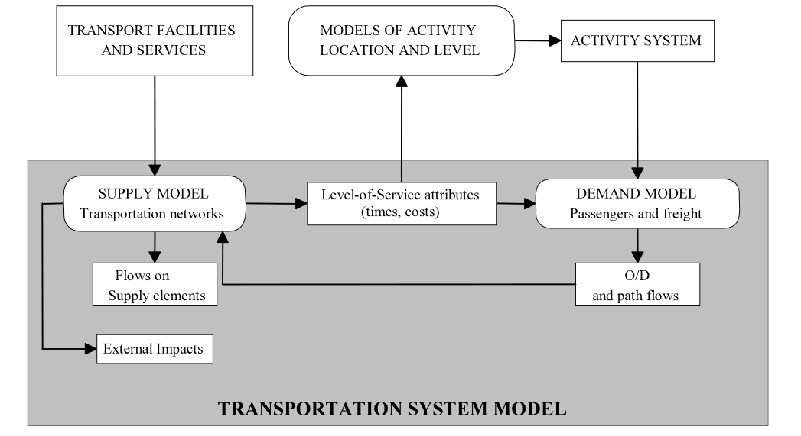

```{r child = "setup.Rmd"}
```

```{r packages, echo=FALSE, message=FALSE, warning=FALSE}
library(tidyverse)
library(openintro)
loans_full_schema <- loans_full_schema %>%
  mutate(grade = factor(grade, ordered = TRUE))
```

```{r xaringan-tile-view, echo=FALSE}
xaringanExtra::use_tile_view()
```

```{r xaringan-editable, echo=FALSE}
xaringanExtra::use_editable(expires = 1)
```

```{r xaringan-panelset, echo=FALSE, message=FALSE, warning=FALSE}
xaringanExtra::use_panelset()
xaringanExtra::style_panelset_tabs(panel_tab_font_family = "sans-serif")
```

```{r xaringanExtra-clipboard, echo=FALSE}
htmltools::tagList(
  xaringanExtra::use_clipboard(
    button_text = "<i class=\"fa fa-clipboard\"></i>",
    success_text = "<i class=\"fa fa-check\" style=\"color: #90BE6D\"></i>",
    error_text = "<i class=\"fa fa-times-circle\" style=\"color: #F94144\"></i>"
  ),
  rmarkdown::html_dependency_font_awesome()
)
```

```{r xaringan-fit-screen, echo=FALSE}
xaringanExtra::use_fit_screen()
```

```{r xaringan-extra-styles, echo=FALSE}
xaringanExtra::use_extra_styles(
  hover_code_line = TRUE,         #<<
  mute_unhighlighted_code = TRUE  #<<
)
```

```{css include=FALSE}
.panelset {
   --panel-tab-foreground: currentColor;
   --panel-tab-background: unset;
   --panel-tab-active-foreground: currentColor;
   --panel-tab-active-background: unset;
   --panel-tab-active-border-color: currentColor;
   --panel-tab-hover-foreground: currentColor;
   --panel-tab-hover-background: unset;
   --panel-tab-hover-border-color: currentColor;
   --panel-tab-inactive-opacity: 0.5;
   --panel-tabs-border-bottom: #ddd;
   --panel-tab-font-family: Sen;
   --panel-tab-background-color-active: #fffbe0;
   --panel-tab-border-color-active: #023d4d;
}

.panelset .panel-tabs .panel-tab > a {
	color: #023d4d;
}

.panelset .panel-tabs {
  font-size: 0.5rem;
}
```

class: center, middle
background-image: url("img/logo.png")
background-position: 90% 10%
background-size: 30%


## WELCOME TO THE COURSE

.larger[
.center[
**Advanced Transport Modelling** 
]]

Fridays - 17:00   
Spring 2022   
Discussion channels: [Discord]( https://discord.gg/csPCPXdJ)   
Assincronous content: [https://retaoliveira.github.io/places/courses/atm/](https://retaoliveira.github.io/places/courses/atm/)

**Prof. Renata Oliveira**

???

The site will be developed throughout the course and some parts of it are still in portuguese!

In Discord we have a text channel for exchanges and voice channels for remote meetings. We'll have specific channels for the whole class and for groups. 

---

## If you are here, I expect you to know a little bit of.... 
<hr></hr>

.large[
.pull-left[
**Algebra**   

**Statistics**    
 
**Operations Research**
]

.pull-right[
**Data and Space**   

**Four-stage model**

]
]

???


**Algebra**   
- basic operations of Matrix Algebra

**Statistical modelling**    
- probabilities   
- estimation methods and hypotheses testing   

**Operations Research**
- graphs and network representation
- stochastic modelling and simulation
]

.pull-right[
**Data and Space**   
- sampling theory   
- basic data-collection methods
- imputation methods
- GIS and GIS-T

**Four-stage model**
- generation
- distribution
- mode choice
- assignment

I CAN HELP YOU CATCH UP WITH ANY NECESSARY KNOWLEDGE!
---

## I hope you will have FUN! We are going to...
<hr></hr>

- develop **applied projects** (project-based learning)   
- acquire **computing skills** in transport modelling (hands-on learning)   
- **collaborate** with your **mate** (peer-education and think-pair-share)
- engage in **self-learning** (flipped classroom)

.center[
  
]


---

## You'll be able to.... 
<hr></hr>

-	**Explain** the complexity of modelling heavily utilised transport systems and networks, both verbally and in writing.

- **Select**, **specify**, and **use** the appropriate model and forecasting techniques for different scenarios to support the interpretation of proposed transport solutions at local and strategic level, and for different modes.

- **Interpret** model outputs to make practical recommendations.

-	**Use** advanced techniques for the analysis of traffic and travel generation, to enable the evaluation of and monitoring of transport solutions.

???

- What is the tradicional modelling framework and where we are heading in transportation

- Explore different transportation modes in modelling and consider the best trade-off while choosing methods, data and techniques for representing transport in the computer environement to understand and assess transport interventions in the urban and regional contexts.

- Make great use of modelling outputs for better places

- Use advanced techniques, through Free and Opensource software, for transportation planning


---

## Grading Policy
<hr></hr>

- **15%** of your grade will be determined by your **attendance** and **participation** in the **intermediate seminars**.

- **35%** of your grade will be determined by your deliveries concerning **computer lab activities**.

- **10%** of your grade will be determined by your **attendance** and **participation** in the **final seminar**.

- **30%** of your grade will be determined by the **integration project report**.

- **10%** of your grade will be determined by **self and peer-assessment**.


???

I want you to learn! If you engage, you will learn!

---

## Everything is in the Syllabus
<hr></hr>

```{r echo=FALSE, message=FALSE, warning=FALSE}
knitr::include_graphics("img/syllabus.png")
```

???

There are lots of additional information on the Syllabus delivered through the website of the discipline, but feel free to ask! 

---

## Let's get serious about modelling!
<hr></hr>

.pull-left-narrow[
  
 
]

.pull-right-wide[
.large[
- What is a model?
- Why do we model transportation phenomena?
- Is it easy to model transportation?
- Where is transportation modelling heading?
- And this course?
]
]

---

## What is a model?

<hr></hr>
.large[
a usually miniature representation of something

a system of postulates, data, and inferences presented as a mathematical description of an entity or state of affairs

an example for imitation or emulation

a person or thing that serves as a pattern for an artist
]
.small[
Source: https://www.merriam-webster.com/dictionary/model
]

???

There are many definitions of models! What is ours?

---

## What is a model?

<hr></hr>
.large[
~~a usually miniature representation of something~~

**a system of postulates, data, and inferences presented as a mathematical description of an entity or state of affairs**

~~an example for imitation or emulation~~

~~a person or thing that serves as a pattern for an artist~~
]
.small[
Source: https://www.merriam-webster.com/dictionary/model
]

???

The definition is simple and we need to explore the specificities of transport modelling! We have great challenges ahead!

---

## Why do we model transportation phenomena?

.midi[
.question[
Modelling is an important part of most decision-making processes with no real-world interference.
]


.question[
Get the best understanding that we can of the current situation and how this may, with or without our interference, evolve in the future. 
]


.question[
Representation and analysis of the interactions among **supply**, **demand** and **activity systems**. 
]


.question[
**Design** and **ex-ante evaluation** of transport systems cannot be measured
]
]

???

Modelling is an important part of most decision-making processes with no real-world interference.

Get the best understanding that we can of the current situation and how this may, with or without our interference, evolve in the future. 


Models can be descriptive, but more often there is the explicit aim of seeking the key links between causes and effects in transport decision-making either by the providers of transport services or by the users.

**Design** and **ex-ante evaluation** of transport systems cannot be measured


---

## Why do we model transportation phenomena?


<hr></hr>

```{r echo=FALSE, fig.cap="Cascetta, 2009", message=FALSE, warning=FALSE, out.width="75%"}

```

???

Transportation is and essential element of cities and need be part of urban planning. We need to model the supply (infrastructure and service) and understand the external impacts of the supply. 

As a result of transportation supply, we have the Level-of-service, which concerns time and costs, among other attributes that impact the demand. 

Demand models concern passengers and freight and depend on the location and intensity of activities. 

The activities system is impacted by the level of service attributes and the patterns of spatial and social interactions will impact the decisions regarding the supply of transport. 

Therefore, we model transport to understand the attributes that generate and materialize the human interactions. **Transport is a derived demand**. 

---


## Is it easy to model transportation?

<hr></hr>

.large[
.pull-left[

- capacity constraints
- variation across the time dimension
- dynamic and pseudo-dynamic assignment - queing

]


.pull-right[
- availability of data
- complexity
- behavioural - derived demand
- trip chaining
- multiple consumer classes
]
]

???

Transport modelling has been evolving and different challenges emerge:
- we need to include capacity constraints and variation across the time dimension into models to represent the actual system with focus on the integration on the urban system. 

- More sofisticated approaches are being explored considering space-time changes, such as dynamic and pseudo-dynamic assignment - queing

- Transportation modelling depends on data and there should be a concern on the trade-off between complexity and representation/communication ability.

- Behavioural challenges that concern peoples' choices have araisen. 

---

## Where is transportation modelling heading?
<hr></hr>

.large[
- **Balances complexity** and **decision support/communication ability**.  
- Is as **disaggregated** as possible, limited to data and communicability.   
- **Isolates key relationships**, not to replicate the entire structure.   
- Contains many of the key features of the complete structure, but is **simplified** to aid analysis.   
- Focus on the **key relationships** and explores the available data   
- Is concerned with **causal effects**.   
- Focus on **policy-making** for **different societal groups**   
]

---

## Where is transportation modelling heading?
<hr></hr>

.large[
- Is **not** based on **“political modelling"**, but takes into account diversity    
- Is **flexible** between **forecasting** and **backcasting** approaches.   
- Its framework concerns **transport as derived demand**.    
- Aims at **managing the city** and **not** only **accommodating demand**. Make the **best use of existing capacity**.   
- Takes into account **social, environmental and economic pressures** and **changes** in **space** and **time**.   
- Concerns **effective assessments**, usually within a broad cost–benefit framework   
- Is **reproducible**, **crowdsourced** and **understandable** by different actors.
]
---

## And this course?
<hr></hr>

.large[
**Course outline**

- Fundamental concepts and principles of **discrete choice modelling**   
- **Accessibility-oriented planning** and **LUTI** (Land use and Transport integrated models)   
- **Causal inference** in transportation modelling   
- Forecasting and **backcasting** planning approaches   
- Modelling **networks as complex systems**   
- Methods for **Evaluation** and **Comparison** of Transportation System Projects   
]

---

## Homework for next week
<hr></hr>

.pull-left[
**Preliminary activity for next class**

.midi[
Cascetta (2009) - Chapter 3: Random Utility Theory

[Video 1](https://www.youtube.com/watch?v=IFjD3NMv6Kw)   
[Video 2](https://www.youtube.com/watch?v=Cgw9oHDfJ4k&t=116s)   
[Video 3](https://www.youtube.com/watch?v=8Hm2GCKdd5g)

[Talking Transport Transformation - S01-E01 | Sustainable Mobility at the Heart of a Green Recovery with Dr. Jörn Richert](https://podcasts.google.com/feed/aHR0cHM6Ly90YWxraW5ndHJhbnNwb3J0dHJhbnNmb3JtYXRpb24ucG9kaWdlZS5pby9mZWVkL2FhYw/episode/NzdiOTI0OGE4YTkwYTdjZjY1YTcxZDZmYjhiNTkwYzg?sa=X&ved=0CAUQkfYCahcKEwi47vSGtpzyAhUAAAAAHQAAAAAQEA)
]]

.pull-right[
.midi[
**Lab**   
Computer lab 1: review of the four-stage model

**In retrospect... or learning backlog**   
Cascetta (2009) - Chapter 1: Modeling Transportation Systems: Preliminary Concepts and Application Areas   
Hensher (2010) - Chapter 2: History of Demand Modelling
Introduction to R and basic statistics [Link](https://retaoliveira.github.io/places/conteudo/intro_r/)

**Padlet**
Fill in the Padlet for us to know each other (https://padlet.com/renataoliveira/hm3w1rqy2bh1tb1e)
]]

---


.pull-left-narrow[
  
]

.pull-right-wide[

renataoliveira@gmail.com

https://retaoliveira.github.io/places

<i class="fa fa-twitter" aria-hidden="true"></i> [@retaoliveira](https://twitter.com/retaoliveira)

<i class="fa fa-github" aria-hidden="true"></i> [@retaoliveira](https://github.com/retaoliveira)

]

.center[.larger[
THANK YOU!!!!!
]]

