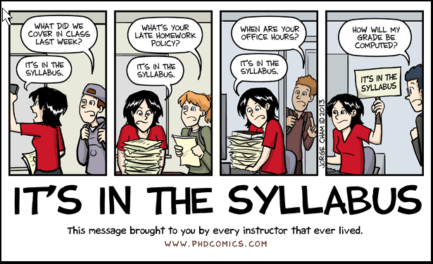

```{r child = "setup.Rmd"}
```

```{r packages, echo=FALSE, message=FALSE, warning=FALSE}
library(tidyverse)
library(openintro)
loans_full_schema <- loans_full_schema %>%
  mutate(grade = factor(grade, ordered = TRUE))
```

```{r xaringan-tile-view, echo=FALSE}
xaringanExtra::use_tile_view()
```

```{r xaringan-editable, echo=FALSE}
xaringanExtra::use_editable(expires = 1)
```

```{r xaringan-panelset, echo=FALSE, message=FALSE, warning=FALSE}
xaringanExtra::use_panelset()
xaringanExtra::style_panelset_tabs(panel_tab_font_family = "sans-serif")
```

```{r xaringanExtra-clipboard, echo=FALSE}
htmltools::tagList(
  xaringanExtra::use_clipboard(
    button_text = "<i class=\"fa fa-clipboard\"></i>",
    success_text = "<i class=\"fa fa-check\" style=\"color: #90BE6D\"></i>",
    error_text = "<i class=\"fa fa-times-circle\" style=\"color: #F94144\"></i>"
  ),
  rmarkdown::html_dependency_font_awesome()
)
```

```{r xaringan-fit-screen, echo=FALSE}
xaringanExtra::use_fit_screen()
```

```{r xaringan-extra-styles, echo=FALSE}
xaringanExtra::use_extra_styles(
  hover_code_line = TRUE,         #<<
  mute_unhighlighted_code = TRUE  #<<
)
```

```{css include=FALSE}
.panelset {
   --panel-tab-foreground: currentColor;
   --panel-tab-background: unset;
   --panel-tab-active-foreground: currentColor;
   --panel-tab-active-background: unset;
   --panel-tab-active-border-color: currentColor;
   --panel-tab-hover-foreground: currentColor;
   --panel-tab-hover-background: unset;
   --panel-tab-hover-border-color: currentColor;
   --panel-tab-inactive-opacity: 0.5;
   --panel-tabs-border-bottom: #ddd;
   --panel-tab-font-family: Sen;
   --panel-tab-background-color-active: #fffbe0;
   --panel-tab-border-color-active: #023d4d;
}

.panelset .panel-tabs .panel-tab > a {
	color: #023d4d;
}

.panelset .panel-tabs {
  font-size: 0.5rem;
}
```

class: center, middle
background-image: url("img/logo.png")
background-position: 90% 10%
background-size: 30%


## WELCOME TO THE COURSE

.larger[
.center[
**Advanced Transport Modelling** 
]]

Fridays - 17:00   
Spring 2022   
Discussion channels: [Discord]( https://discord.gg/csPCPXdJ)   
Assincronous content: [https://retaoliveira.github.io/places/courses/atm/](https://retaoliveira.github.io/places/courses/atm/)

**Prof. Renata Oliveira**

---

## If you are here, I expect you to know a little bit of.... 
<hr></hr>

.pull-left[
**Algebra**   
- basic operations of Matrix Algebra

**Statistical modelling**    
- probabilities   
- estimation methods and hypotheses testing   

**Operations Research**
- graphs and network representation
- stochastic modelling and simulation
]

.pull-right[
**Data and Space**   
- sampling theory   
- basic data-collection methods
- imputation methods
- GIS and GIS-T

**Four-stage model**
- generation
- distribution
- mode choice
- assignment
]

---

## I hope you will have FUN! We are going to...
<hr></hr>

- develop **applied projects** (project-based learning)   
- acquire **computing skills** in transport modelling (hands-on learning)   
- **collaborate** with your **mate** (peer-education and think-pair-share)
- engage in **self-learning** (flipped classroom)

.center[
  
]

---

## You'll be able to.... 
<hr></hr>

-	**Explain** the complexity of modelling heavily utilised transport systems and networks, both verbally and in writing.

- **Select**, **specify**, and **use** the appropriate model and forecasting techniques for different scenarios to support the interpretation of proposed transport solutions at local and strategic level, and for different modes.

- **Interpret** model outputs to make practical recommendations.

-	**Use** advanced techniques for the analysis of traffic and travel generation, to enable the evaluation of and monitoring of transport solutions.

---

## Grading Policy
<hr></hr>

- **15%** of your grade will be determined by your **attendance** and **participation** in the **intermediate seminars**.

- **35%** of your grade will be determined by your deliveries concerning **computer lab activities**.

- **10%** of your grade will be determined by your **attendance** and **participation** in the **final seminar**.

- **30%** of your grade will be determined by the **integration project report**.

- **10%** of your grade will be determined by **self and peer-assessment**.

---

## Everything is in the Syllabus
<hr></hr>

```{r echo=FALSE, message=FALSE, warning=FALSE}

```

---

## Let's get serious about modelling!
<hr></hr>

.pull-left-narrow[
  
 
]

.pull-right-wide[
.large[
- What is a model?
- Why do we model transportation phenomena?
- Is it easy to model transportation?
- What is a good model?
- Where is transportation modelling heading?
- And this course?
]
]

---

## What is a model?

<hr></hr>
.large[
a usually miniature representation of something

a system of postulates, data, and inferences presented as a mathematical description of an entity or state of affairs

an example for imitation or emulation

a person or thing that serves as a pattern for an artist
]
.small[
Source: https://www.merriam-webster.com/dictionary/model
]


---

## What is a model?

<hr></hr>
.large[
~~a usually miniature representation of something~~

**a system of postulates, data, and inferences presented as a mathematical description of an entity or state of affairs**

~~an example for imitation or emulation~~

~~a person or thing that serves as a pattern for an artist~~
]
.small[
Source: https://www.merriam-webster.com/dictionary/model
]


---

## Why do we model transportation phenomena?

Modelling is an important part of most decision-making processes.
No real-world interference

.question[
Representation and analysis of the interactions among **supply**, **demand** and **activity systems**
]

.question[
**Design** and **ex-ante evaluation** of transport systems cannot be measured
]

In order to model interactions within households such as the sharing and trading of activities, it require data for the entire family and 
how these interact in their daily transport.

Get the best understanding that we can of the current situation and how this may, with or without our interference, evolve in the future. 

the methods, be they quantitative or qualitative, which allow us to study the relationships that underlie transportation decision-making

descriptive, but more often there is the explicit aim of seeking the key links between causes and effects in transport decision-making either by the providers of transport services or by the users.

<hr></hr>

```{r echo=FALSE, fig.cap="Cascetta, 2009", message=FALSE, warning=FALSE, out.width="75%"}
knitr::include_graphics("img/model.png")
```


---


## Is it easy to model transportation?

<hr></hr>

.large[
.pull-left[

- capacity constraints
- variation across the time dimension
- dynamic and pseudo-dynamic assignment - queing
]


.pull-right[
- complexity
- behavioural - derived demand
- trip chaining
- multiple consumer classes
]
]

---

## What is a good model?
<hr></hr>

Models are often complex and highly elaborate, but interestingly history suggests that those models that have exerted the greatest influence have been elegant and simple.

The key point is that models seek to isolate key relationships, not to replicate the entire structure.

Focus on the key relationships and the data


Complexity x isolate the key factors that influence the outcome of any action. 

It has many of the key features of the complete structure, but is simplified to aid analysis.

academics focus on developing transport models that offer a reasonable method of exploring the technical efficiency of a transport system (e.g., in terms of traffic flows).
policy-makers are much more interested in the impacts of various transport actions on different societal groups and that this distributional consideration far outweighs matters of technical efficiency.
“political modelling" - decisionmakers often adopt models not for their technical merit but rather because they offer a framework akin to their political ideology

Remaining with the issue of forecasting, the use to which the vast majority of models are in practice put, one of the problems in model assessment is that very little ex post analysis has been done on the accuracy of forecasts.

Forecasting assessment of models is that it is often more difficult to predict the future values of the explanatory variables than it is to predict the transport effects that are of interest.

**Causality** was seen as less relevant than forecasting performance. Indeed such aggregate correlations are often inaccurate and result is what is known as the fallacy of ecological correlation (or reversal of signs).

understanding the **relationships** that influence travel behaviour have moved to the forefront of much of the modelling effort.
This is largely because the issues confronting policymakers have changed. There is now more concern with managing transport than with accommodating transport. This poses a whole new series of questions that require proactive policy measures rather than a simple provision of roads, berths, runways and other infrastructure.

why goods are being shipped, why people choose to travel at a specified time, why employers move to given area and why they use a specific freight transport mode is one side of an argument to move to a greater use of behaviourally rich models.
Linked to this was the needed to develop models that would forecast the impacts of new provision on transport use, so that effective assessments could be made, usually within a broad cost–benefit framework.

Social, environmental and economic pressures make it difficult to significantly expand the provision of transport infrastructure in many countries. In addition, new life-styles, advanced production management techniques, the much greater importance of the service economy and new working practices remove many of the constraints that formerly led to peaking.
The consequent move to policy measures designed to make the best use of existing capacity, including its physical maintenance, requires models that will allow for people being able to change the times at which they travel and for the new logistics on the freight side. The growth in non-work travel, flexitime and longer shopping and personal business hours has also shifted the spotlight away from the need for fixed peak hour models.
intelligent transport system (ITS)
Reproudicibility
Communication

---

## Where is transportation modelling heading?


All these systems are designed to get more capacity or better performance out of the transport system, and place fresh demands on modelling the response of providers and users of transport to this new information. A
ML
What kinds of data are needed to respond to these emerging issues of transport management, mobility and provision? As the issues have broadened, and thrown more weight onto individuals, companies and their choice, it has become clearer that these agents do not necessarily make the same choices year after year

The long-standing assumption that model parameters are largely invariant with time, or at least change slowly, is much less easy to defend. We have already seen some efforts made at addressing this issue by means of the temporal study of panels of people. In terms of passenger transport, these panels have been set up to trace out such things as how and when vehicles are acquired or disposed of, what effects the family life cycle has on travel and activity behaviour and how stable travel and location choices remain over time. Consequently, panel survey methods are now being used, and the necessary analysis approaches and models are being developed. This greater appreciation of change has also led to support for collecting travel survey data on a continuous basis, rather than once every ten years.

In addition to the focus on individuals, it is increasingly being recognized that institutions and their decisions need to be modelled more fully. Disagregatted

, as mentioned earlier, many transport networks used to have their capacities defined by peak-volume commuter traffic, this is no longer the case. Freight transport, for instance, often poses congestion problems on the roads and leisure traffic imposes pressure on airport capacity

e trade-off between modelling relevance and modelling complexity. I

 How many population strata or types of people do we need to achieve a good representation and understanding of a problem?  In how much detail do we need to measure certain variables to replicate a given phenomenon?  Space is crucial in transport; at what level of detail do we need to code the origin and destination of travellers to model their trip making behaviour?


in very many cases the nature of the data restricts the choice of model to a single option.


---

## And this course?

**Course outline**

- Fundamental concepts and principles of **discrete choice modelling**   
- **Accessibility-oriented planning** and **LUTI** (Land use and Transport integrated models)   
- **Causal inference** in transportation modelling   
- Forecasting and **backcasting** planning approaches   
- Modelling **networks as complex systems**   
- Methods for **Evaluation** and **Comparison** of Transportation System Projects   

---

## Homework for next week

**Reading**   
Cascetta (2009) - Chapter 1: Modeling Transportation Systems: Preliminary Concepts and Application Areas   
Hensher (2010) - Chapter 2: History of Demand Modelling

**Lab**   
Computer lab 1: review of the four-stage model

**In retrospect... or learning backlog**   
Introduction to R and basic statistics


